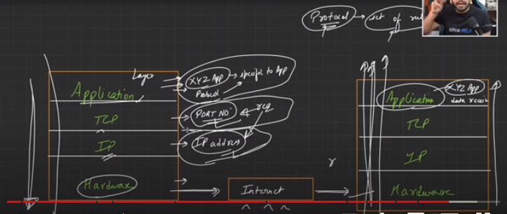

# Basic Terms

**Web** :
A system where documents and resources exist in a inter-connected form, they can be accessed using internet.

>  ( Smaller Entity ) -> web ⊆ Internet ( Big Entity )

### Web
1. website
2. webapp

**Website** : 
- static content
- less user interactive
- read-only
- Example: Wikipedia

**Webapp** :
- dynamic content
- more user interactive
- read & write
- Example: Amazon

#### Webapp is divided basically into 3 parts :

1. Front-end
2. Back-end
3. Data-Base

---
**Network** : all resources (computer , mobile ) connected to each other.

_LAN_ - local area network (router of my house )

_MAN_ - metropolitan are network ( cities connected or states )

_WAN_ - wide area network ( countries connected)

---
**Internet** : submission of all smaller networks comes under internet(N1+N2+N3.... )
> Inter -> Inter-connected
> Net -> Networks 
(Network of Networks)

**IP Address** :  identification name of computer or server you want o access or send request to. 
Address for identify each device uniquely. 

---
**Client** : the one who sends the request to the server  ( so that server performs the desired operations to be performed for the client) like  -- get, post , put , delete 

**Server** : the one who performs the operations (delete , create , edit ),
and sends response back to client

CLIENT -- laptop , mobile , app , CLI 

SERVER -  DB  , file, app , web , email servers 

> _request send – domain name to IP address find kara (kiss server ya kiss machine ko point kar rha hai )  - machine found – server respond the data_

---
**Browser** : It is a tool to access documents, websites, web applications. 

**Browser Engine** : It is an application which is is used to access resources[websites, web applications]. 
Ex. (Chrome(Google), Safari(Apple), Firefox, Opera) 

---
**DNR** [Domain Name Resolution] : It convert domain name into IP address.
facebook.com -> 30.50.6.1.0

**ISP** [Internet Service Provider] : client req -> ISP -> Internet
Ex:- Artiel , jio etc..

**Packets** : Data trasfers from one system to another in form of small chunks called Packets.

> Interaction between two apps

### Example : mail transfer from one gmail to other gmail

#### USER A
- application -> mail 
- TCP -> Port No (to which application in other system)
- IP -> IP address of system to send (USER B IP ADDRESS)
- Hardware -> Internet

#### USER B
- Internet -> Hardware
- IP address found
- TCP app address to be received found
- application -> mail received

More info -> Research on Network System 

